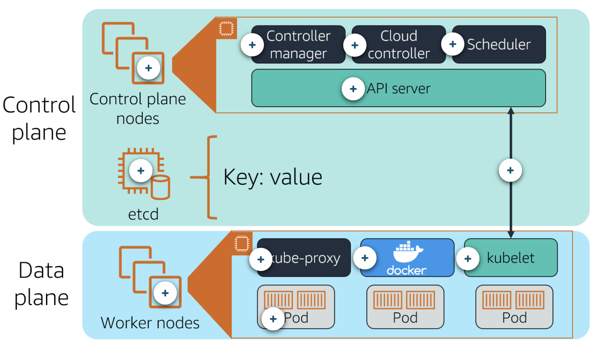

# Containerization

## Docker

### References

- [Installation](https://docs.docker.com/engine/install/centos/#install-using-the-repository)
- [Best practices & Developing with Docker](https://docs.docker.com/develop/develop-images/multistage-build/#stop-at-a-specific-build-stage)
- [K8S networking](https://docs.docker.com/desktop/networking/)
- [k8s reference](https://kubernetes.io/docs/reference/kubernetes-api/workload-resources/deployment-v1/)

### Change Docker Data Root Path on Windows

Either from setting or editing `%USERPROFILE%\.docker\daemon.json` and set `data-root` as following

```json
{
  "data-root": "E:\\Docker\\ProgramData",
  "experimental": false,
}
```

### Installation on CentOS

```bash
sudo dnf config-manager --add-repo https://download.docker.com/linux/centos/docker-ce.repo

sudo dnf install docker-ce docker-ce-cli containerd.io

sudo systemctl start docker
sudo systemctl enable --now containerd.service
sudo systemctl enable --now docker.service
sudo systemctl status docker.service

# If you would like to use Docker as a non-root
# user, you should now consider adding
# your user to the “docker” group with something like:
sudo usermod -aG docker zxc

# Docker compose
# https://docs.docker.com/compose/install/
sudo curl -L "https://github.com/docker/compose/releases/download/1.28.5/docker-compose-$(uname -s)-$(uname -m)" -o /usr/local/bin/docker-compose

sudo chmod +x /usr/local/bin/docker-compose

# testing :D
docker-compose --version

# Auto Completion
# https://docs.docker.com/compose/completion/
sudo dnf install bash-completion
sudo curl -L https://raw.githubusercontent.com/docker/compose/1.28.5/contrib/completion/bash/docker-compose -o /etc/bash_completion.d/docker-compose

# For Remote Access From Windows Host to Linux Guest (insecure)
# Edit the following file to add the param -H like
# [Service]
# ExecStart=
# ExecStart=/usr/bin/dockerd -H fd:// -H tcp://127.0.0.1:2375
# 0.0.0.0:2375 would enable binding on all interfaces
sudo vi /etc/systemd/system/multi-user.target.wants/docker.service
sudo systemctl daemon-reload
sudo systemctl restart docker.service

# On host (windows) set the following env variable and start using docker cli
$ENV:DOCKER_HOST="tcp://192.168.88.2:2375"
#$ENV:DOCKER_HOST="ssh://zxc@192.168.88.2"
```

### Rules

- Always create a network bridge and don't use the default one for your apps. The default bridge network does not have a built-in DNS service. So you'd have to use `--link` to link containers to each other using their names.
- Make `RUN` in Dockerfile merged as much as possible.
- Dockerfile : Keep things to be changed the most at the bottom while things to be changed the least at the top.
- Dockerfile : Logging into container stdout and not local container file.
- Dockerfile : `RUN npm install && npm cache clean` is same as `RUN npm install; npm cache clean`. Difference is that `;` prevent dependency of the second command to run if the first is successful.
- Dockerfile sample

    ```DockerFile
    # Logging directed to stdout and stderr
    RUN ln -sf /dev/stdout /var/log/nginx/access.log \
	&& ln -sf /dev/stderr /var/log/nginx/error.log
    ```

### Commands

```bash
# Execute command in running container
# and also enter interactive mode
docker container exec -it <container_name> bash

# Show details of one container config
docker container inspect <container_name>

# Show the logs of container
# Use --follow to tail the logs
docker container logs <container_name>

# Show running containers
docker container ls

# Show all containers
docker container ls -a

# Show ports used by a container
docker container port <container_name>

# Remove multiple containers at once
# Use -f to force removing running containers
docker container rm <container_id> <container_id> <container_id>

# Run container from nginx image
# and mapping port 80 on host to port 80 on guest
docker container run --publish 80:80 nginx

# Run container from nginx image with CMD override
# to start interactively using bash
docker container run -it --publish 80:80 nginx bash

# Create bind mount from current path to /app
# and create unnamed volume to /app/node_modules
# preventing mapping /app/node_modules in the container
# to anything in the host and leaving it there untouched
# but it's actually mapped to the unnamed volume path on the host
docker container run -v /app/node_modules -v $(pwd):/app <image_name>

# Start stopped container interactively. ai for usage with start.
docker container start -ai --publish 80:80 nginx bash

# Performance stats for all containers
docker container stats

# Stop running container
docker container stop <container_id>

# Show processes inside a container
docker container top <container_name>

# Build an image out of the current directory using
# existing DockerFile passing environment
# variables while doing so
docker image build --build-arg VAR_NAME1=VAR_VALUE1 VAR_NAME2=VAR_VALUE2

# To build image with tag, repo and image name
# The dot in the end for the current location
# Build is done from Dockerfile
docker image build -t <REPOSITORY_NAME>/<IMAGE_NAME>:<TAG> .

# Show the history of an image layers
docker image history <image_id>:<tag>

# Details about an image
docker image inspect <image_id>

# List Images
docker image ls

# Remove unused images
docker image prune

# Pull image from repo without running it
docker image pull nginx

# Push image to docker hub
docker image push <username>/<repo>
docker image push <username>/<repo>:<tag>

# Remove an image
docker image rm webserver:1.0

# To tag an image specify the source image
# and tag then the target image and tag
# For example here the source is ubuntu:16.10
# and the target is webserver:1.0
# Another example is tagging an image you already built
# and this could be done same way but the source
# would be the image id that you built
docker image tag ubuntu:16.10 webserver:1.0
docker image tag 3ee637e54b4f webserver:1.0

# Tag an image you got with your own name and tag.
# The <image_name> is the source image
docker image tag <image_name> <username>/<repo>:<tag>

# Login to docker hub
docker login

# Login to specific server
docker login <server_url>

# Details about specific network
docker network inspect <network_name>

# list networks
docker network ls

# Create network
docker network create <network_name>

# Connect a container to specific network
docker network connect <network_id> <container_id>

# Info about specific volume
docker volume inspect <volume_name>

# List volumes
docker volume ls

# Remove unused volumes
docker volume prune

# Delete cached images in the node
docker system prune -a

# To print command of docker container running
# https://github.com/lavie/runlike/
docker run --rm -v /var/run/docker.sock:/var/run/docker.sock:ro assaflavie/runlike <YOUR-CONTAINER>

# Kill the container, useful for kubernetes testing
docker kill container_id

# MacOS shutdown docker destkop and reopen it for docker
# daemon to start
pkill -SIGHUP -f /Applications/Docker.app 'docker serve' 
open -a Docker
```

### Docker container run options

`--publish 8080:80` Maps port 8080 on host to port 80 on containers. It's in `<host>:<container>` format.  
`-publish-all` Publish all exposed ports to random ports.  
`-d` or `-detach` Run container in detached mode.  
`--name` Specify a name to a container.  
`-e ENV_VARIABLE=value` specify environment variable for this container when it gets run.  
`-it` Interactive container while `-i` for STDIN attaching and `-t` for terminal output attaching.  
`--network <network_name>` Select network to attach the container to it.  
`--rm` Automatically remove the container when it exits.  
`--net-alias` or `--network-alias` Assign another name used in network besides the container name.  
`-v` Volume applying its configs. See Volumes section below for more info.  
`-dit` is shorthand for detached mode which run command in the background and interactive to keep STDIN open even if not attached and finally Allocate a pseudo-TTY.

### Networking

Drivers types of containers networks

- Bridge - Default bridge network created for all containers
- None - Isolated containers
- Host - Connected directly to host network

### DockerFile

- [Unnamed volumes created in Dockerfile are removed](https://stackoverflow.com/a/46992367/7054574) when using `rm` with `docker container run`.
- Files to copy from host must be in the working directory and not outside.
- `ENTRYPOINT` for making the container dedicated to specific command and `CMD` will be passed to entry point. [Check this for more explanation](https://stackoverflow.com/questions/21553353/what-is-the-difference-between-cmd-and-entrypoint-in-a-dockerfile).
- Recommended order is
    - FROM - Base image
    - LABEL
    - ARG
    - ENV - Environment variables
    - RUN - run commands on the container in the build stage. Every `RUN` executed in separate shell.
    - WORKDIR - Like `CD`. Preferred over using `RUN cd /some/path`
    - USER
    - COPY - From host to container.
    - ADD
    - EXPOSE - Open ports from container to virtual network. Just allowing packets to be received on specified container port(s).
    - CMD - Run command when launching the container. Use json array format.
    - HEALTHCHECK - To check the app inside the container is running in proper way.
    - ONBUILD - To run the command in the [build of a Dockerfile that uses current one as FROM image base](https://stackoverflow.com/a/34865361/7054574)

- Examples

    ```Dockerfile
    # Every 5 seconds ping to the API endpoint or exit with status 1 if timeout of 3 seconds is reached
    HEALTHCHECK --interval=5s --timeout=3s CMD curl --fail http://localhost:8091/pools || exit 1
    ```

    Spring Boot

    ```Dockerfile
    # Global Args
    ARG WORKDIR_APP=/workspace/app
    ARG EXTRACTED=${WORKDIR_APP}/target/extracted

    # Build stage
    FROM maven:3-eclipse-temurin-17-alpine as builder

    ARG SERVICE_NAME
    ARG WORKDIR_APP
    ARG EXTRACTED
    WORKDIR ${WORKDIR_APP}

    COPY pom.xml .
    COPY ./docker/pom.jsh .
    COPY ${SERVICE_NAME}/*.xml ./${SERVICE_NAME}/
    COPY ${SERVICE_NAME}/src ./${SERVICE_NAME}/src

    RUN jshell -R-Dproject=${SERVICE_NAME} pom.jsh

    # Mount of type cache is visible to the current executed command
    # and must be specified to other commands that wish to see it as well
    RUN --mount=type=cache,target=/root/.m2 mvn -B dependency:resolve dependency:resolve-plugins dependency:go-offline
    RUN --mount=type=cache,target=/root/.m2 mvn -B install \
        && mkdir -p target/extracted  \
        && java -Djarmode=layertools -jar ${SERVICE_NAME}/target/*.jar extract --destination target/extracted

    # Run stage using non-root user
    # https://docs.spring.io/spring-boot/docs/current/reference/htmlsingle/#container-images.dockerfiles
    FROM eclipse-temurin:17-jdk-alpine
    ARG USERNAME=developer
    ARG GROUPNAME=developergroup
    RUN addgroup -S "${GROUPNAME}"; adduser --ingroup "${GROUPNAME}" --disabled-password -S "${USERNAME}"

    # Tell docker that all future commands should run as the user
    USER $USERNAME

    ARG WORKDIR_APP
    ARG EXTRACTED
    WORKDIR $WORKDIR_APP

    # Spring Boot build files
    COPY --from=builder $EXTRACTED/dependencies/ ./
    COPY --from=builder $EXTRACTED/spring-boot-loader/ ./
    COPY --from=builder $EXTRACTED/snapshot-dependencies/ ./
    COPY --from=builder $EXTRACTED/application/ ./
    ENTRYPOINT ["java", "org.springframework.boot.loader.JarLauncher"]

    ```

- Sample
    ```DockerFile
    # Source of the image
    FROM ubuntu

    # Parameter could be passed from command line
    # Should be alway before its equal ENV variable
    ARG JQUERY_VERSION=3.2.0
    ENV JQUERY_VERSION=${JQUERY_VERSION}

    # Environment variable. Good to be at the beginning
    ENV DOC_ROOT /var/www/whatever

    # Specify user:group or uid:guid
    USER uu:gg

    # File in host to file in container
    COPY resources/file.css /tmp/file.css

    # Like copy but supports http source
    # and extracting tar.gz source files
    # on the fly
    ADD http://some-website.com/whatever.css ${DOC_ROOT}/whatever.css
    ```

### Images

- TAG represents a snapshot of the image.
- Images are not necessary named. But they are tagged.
- Image is made of layers. Each layer (say in DockerFile) has a unique SHA. These which are stored and cached.
- Containers layers is read-write while image layer is read only. So changing file in a running container will make docker copies the file to container layer to be saved and written.
- Image layers are read only so they can't be changed. Any changes are made to the top read-write container layer.
- Images identified using ID or using `<user>/<repo>:<tag>`. Using `ls` for images shows repository as `<user>/<repo>` pattern.
- First image to create from zero ground and not from containers or previous images could be done in two ways
    - Create image from an empty special image called `scratch`.
    - Use `docker import` to load tarball (of existing server) into Docker.

### Volumes & Bind mounts

- Docker volumes are configuration option for a container that creates a special location outside of that container's union file system to store unique data. Containers sees it like local file path.
- Bind mounts is simply sharing or mounting a host directory or file into a container.
- Volume need manual deletion. No auto-cleaning could be done by docker.
- Using `-v` with `docker container run` allows configuration of volume for the container about to be up. 
    - `-v /var/lib/mysql` creating unnamed volume mounting to specified path on container. Also used to mark the path `/var/lib/mysql` as 'do not touch' folder and do not map it to anything.
    - `-v my-sqldb:/var/lib/mysql` creates named volume.
    - `-v /Users/bret/stuff:/path/container` create a bind mount volume.
    - `--mount type=bind,source=/whatever,target=/whatever` New syntax instead of using `-v`.
- Bind mounting only works with `docker container run`. It's not possible in Dockerfile. But possible in docker compose.
- Using `docker volume create whatever` creates a named volume before running the container. It's pretty rare to need to do this step at all.
- Bind mounts are old and limited but it links local directory to container path on `docker container run` & `docker-compose` levels. Volumes are more powerful and useful for persisting data and backing them up with less limitations.

#### References

- [Locating data volumes](https://stackoverflow.com/questions/43181654/locating-data-volumes-in-docker-desktop-windows)
- [Volumes in Compose](https://docs.docker.com/compose/compose-file/#volumes)
- [Volumes Reference](https://docs.docker.com/engine/reference/builder/#volume)
- [Backup/Restore data from/to volumes](https://docs.docker.com/storage/volumes/#backup-restore-or-migrate-data-volumes)
- [Bind mounts](https://docs.docker.com/storage/bind-mounts/) & [Using them with Compose](https://docs.docker.com/storage/bind-mounts/#use-a-bind-mount-with-compose)
- [k8s services and how it load balances traffic to pods](https://kubernetes.io/docs/concepts/services-networking/service/#virtual-ips-and-service-proxies)


### Docker Compose

- Controls multiple containers relationships
- Formed of 2 parts
    - Yaml formatted file describe containers, networks and volumes.
    - `docker-compose` CLI tool
- Config file name is `docker-compose.yml`. Use -f to specify another file.
    
    ```yml
    # https://docs.docker.com/compose/compose-file/compose-versioning/
    version: '3.1'  # if no version is specified then v1 is assumed. Recommend v2 minimum

    services:  # containers. same as docker run
    servicename: # a friendly name. this is also DNS name inside network
        image: # Optional if you use build:
        command: # Optional, replace the default CMD specified by the image
        environment: # Optional, same as -e in docker run
        volumes: # Optional, same as -v in docker run. See example
            # - /app/node_modules
            # - .:/app
    servicename2:
        image: # Optional to specify a name for the image to be created from dockerfile.
        build: # for building from Dockerfile
            context: . # Means build here
            dockerfile: # specify docker file name

    volumes: # Optional, same as docker volume create. For named volumes mostly.

    networks: # Optional, same as docker network create
    ```
- Use `docker-compose up` for setup of volumes/networks and start all containers. Use `docker-compose down` to stop all containers and remove containers/volumes/networks.
- Use `docker-compose.override.yml` to automatically picked up by docker compose. Notice it inherits the `docker-compose.yml`.
- `docker compose -f docker-compose.yml -f docker-compose-test.yml up -d` to give a base docker-compose file and its override. It must be in order. You may use `config` to combine files into a single compose file like `docker compose -f docker-compose.yml -f docker-compose-test.yml config`.

### Docker Swarm

- A swarm consists managers and workers nodes. A manager node is a node wit raft database. Manager is actually a worker node with more features/privileges.
- Each node is a linux machine for example.
- `service` command replaces the `docker container run` command. Each service fire up some tasks. Each task run a container.
- Verify if swarm is enabled using `docker info` and enable it using `docker swarm init`.
- `docker node` command converts nodes from/to mangers and workers. It also used for bringing servers in and out of the swarm.
- `docker service` command replaces the docker run.
- By using the `bridge` we aggregated both network in a single unit (on a high level). Bridge can even be used to create connection between networks on same host. This is generally required if the host is running multiple containers. `Overlay` networks are usually used to create a virtual network between two separate hosts. Virtual, since the network is build over an existing network.
- As Example, consider, you have multiple docker host running containers in which each docker host has its own internal private bridge network allowing the containers to communicate with each other however, containers across the host has no way to communicate with each other unless you publish the ports on those containers and set up some kind of routing yourself. This is where overlay network comes into play. With docker swarm you can create an overlay network which will create an internal private network that spans across all the nodes participating in the swarm network we could attach a container or service to this network using the network option while creating a service. So, the containers across the nodes can communicate over this overlay network.
- Services `Stacks` is an abstraction to Swarm mode that allows using compose files for docker swarm. `deploy:` is used since we can't use `build:` in this case.
- Compose ignores `deploy:` while Swarm ignores `build:`. Building images is not the job of Swarm. Images should be ready for Swarm to deploy and use.
- `Stacks` actually is multiple services, volumes & overlay networks. It actually replaces the `docker service` command.
- Secrets could be passed on service creation using `--secret <secret_name>`. Then you might use the secret as environment variable like `POSTGRESS_PASSWORD_FILE=/run/secrets/<secret_name>`. Note that secret must be created first. Remove secret using `docker service update --secret-rm` and this will cause a re-deployment of a container.
- Stack deploy is also considered updating the stack command.

Swarm

```bash
# List nodes
docker node ls

# Set node as specific role for example
# setting node2 as manager
docker node update --role <role_name> <node_name>
docker node update --role manager node2

# Creating overlay network for swarm 
# for containers to connect to each other
docker network create --driver overlay <network_name>

# Start alpine container from alpine
# image with command ping 8.8.8.8
docker service create alpine ping 8.8.8.8

# Start alpine container from alpine image with command ping 8.8.8.8
# connecting to specific network and giving a name to the service
# specifying named volume with source as its name (in case of bind mount then source
# is source path) and target is the target path
docker service create --name <service_name> --network <network_name> --mount type=volume,source=<volume_name>,target=/var/lib/postgresql alpine ping 8.8.8.8

# Change number of replicas of two services (web/api)
docker service scale web=8 api=6

# List services
docker service ls

# List services with nodes details
docker service ps <service_name>

# Update service changing the number
# of replicas
docker service update <service_id> --replicas 3

# Just update the image used to a newer version
docker service update --image nginx:1.13.6 <service_name>

# Adding an environment variable and remove a port
docker service update --env-add NODE_ENV=production --publish-rm 8080

# No change but re-balance the resources on tasks and nodes
docker service update --force <service-name>

# Initialize swarm using specific ip
# for connection of swarm nodes
# Copy the result to other nodes and apply it
# to make every node join the same swarm
docker swarm init --advertise-addr 104.236.114.90

# Get the command token to apply to any node
# that you want to become a manager in the swarm
# and join the swarm at once
docker swarm join-token manager
```

Stacks Sample app yml file and architecture.

```yml
# https://docs.docker.com/compose/compose-file/compose-versioning/
version: "3"
services:

  redis:
    image: redis:alpine
    networks:
      - frontend
    deploy: # New option for stacks only
      replicas: 1
      update_config:
        parallelism: 2
        delay: 10s
      restart_policy:
        condition: on-failure
  db:
    image: postgres:9.4
    volumes:
      - db-data:/var/lib/postgresql/data
    networks:
      - backend
    environment:
      - POSTGRES_HOST_AUTH_METHOD=trust
    deploy:
      placement:
        constraints: [node.role == manager] # To be on specific node
  vote:
    image: bretfisher/examplevotingapp_vote
    ports:
      - 5000:80
    networks:
      - frontend
    depends_on:
      - redis
    deploy:
      replicas: 2
      update_config:
        parallelism: 2
      restart_policy:
        condition: on-failure
  result:
    image: bretfisher/examplevotingapp_result
    ports:
      - 5001:80
    networks:
      - backend
    depends_on:
      - db
    deploy:
      replicas: 1
      update_config:
        parallelism: 2
        delay: 10s
      restart_policy:
        condition: on-failure

  worker:
    image: bretfisher/examplevotingapp_worker:java
    networks:
      - frontend
      - backend
    depends_on:
      - db
      - redis
    deploy:
      mode: replicated
      replicas: 1
      labels: [APP=VOTING]
      restart_policy:
        condition: on-failure
        delay: 10s
        max_attempts: 3
        window: 120s
      placement:
        constraints: [node.role == manager]

  visualizer:
    image: dockersamples/visualizer
    ports:
      - 8080:8080
    stop_grace_period: 1m30s
    networks:
      - frontend
    volumes:
      - /var/run/docker.sock:/var/run/docker.sock
    deploy:
      placement:
        constraints: [node.role == manager]

networks:
  frontend:
  backend:

volumes:
  db-data:
```

Architecture


Commands

```bash
# Create a secret using a file
docker secret create <secret_name> whateverFile.txt

# Create a secret using from stdin
echo "passwordExample" | docker secret create <secret_name> -

# List created secrets
docker secret ls

# To execute the compose file
docker stack deploy -c example-whatever.yml <stack_name>

# List services up and running with their running nodes
docker stack ps <stack_name>

# List services up and running
docker stack services <stack_name>
```

Sample compose file with secrets

```yml
version: "3.1"

services:
  psql:
    image: postgres
    secrets:
      - psql_user
      - psql_password
    environment:
      POSTGRES_PASSWORD_FILE: /run/secrets/psql_password
      POSTGRES_USER_FILE: /run/secrets/psql_user

secrets:
  psql_user:
    file: ./psql_user.txt # File on actual host machine beside this file
  psql_password:
    file: ./psql_password.txt
```

### Health check

Command line

```bash
docker run \ 
 --health-cmd="curl -f localhost:9200/_cluster/health || false" \ # false to return 1 since that's the only thing docker will do anything about. The port here is internal to the container.
 --health-interval=5s \ 
 --health-retries=3 \ 
 --health-timeout=2s \ 
 --health-start-period=15s \ 
 elasticsearch:2 
```

Options for Dockerfile

`--interval=DURATION` (default: 30s)  
`--timeout=DURATION` (default: 30s)  
`--start-period=DURATION` (default: 0s) (17.09+)  
`--retries=N` (default: 3)

Basic command using default options

`HEALTHCHECK curl -f http://localhost/ || false`

Custom options with the command. Note there is `CMD` because we are using options like `--timeout` so CMD is mandatory and after the options

`HEALTHCHECK --timeout=2s --interval=3s --retries=3 \ CMD curl -f http://localhost/ || exit 1`

Example is health check in nginx Dockerfile

```Dockerfile
FROM nginx:1.13

HEALTHCHECK --interval=30s --timeout=3s CMD curl -f http://localhost/ || exit 1 
```

Health check in compose / stack file

```yml
version: "2.1" (minimum for healthchecks) 
services: 
 web: 
 image: nginx 
 healthcheck: 
 test: ["CMD", "curl", "-f", "http://localhost"] 
 interval: 1m30s 
 timeout: 10s 
 retries: 3 
start_period: 1m #version 3.4 minimum
```

### Tips

- Use `registry` image to make local registry like docker-hub and use volume with it mapping to `/var/lib/registry` to save images in it. Use tag `<IP>:<PORT>/<NAME>` for the image to push it directly to the docker local registry.
- Use `USER` stanza in your Dockerfile. If group and user not created by your programming language platform image then create one and use it. Container will run using root by default !

  ```Dockerfile
  FROM eclipse-temurin:17-jdk-alpine
  ARG USERNAME=developer
  ARG GROUPNAME=developergroup
  RUN addgroup "${GROUPNAME}"; adduser --ingroup "${GROUPNAME}" --disabled-password "${USERNAME}"
  USER $USERNAME
  ```

--- 

## Kubernetes

### Components

- Control plane: Control plane nodes manage the worker nodes and the pods in the cluster. The control plane determines when tasks are scheduled and where they are routed to.
  - Control plane nodes
    - Controller manager: The controller manager runs background threads called controllers that detect and respond to cluster events.
    - Cloud controller: The cloud controller is a specific controller that interacts with the underlying cloud provider.
    - Scheduler: The scheduler selects nodes for newly created containers to run on.
    - API server: The Kubernetes API server exposes the Kubernetes API and is the frontend for the Kubernetes control plane.  It handles all communication from the cluster to the control plane; none of the other control plane components are designed to expose remote services. The Kubernetes API server is designed to scale horizontally, deploying more instances as necessary. 
  - etcd: This is the core persistence layer for Kubernetes. It is a highly available distributed key value store. This is where the critical cluster data and state are stored.

- Data plane: Worker nodes host the pods that are the components of the application workload. In Kubernetes, the data plane is where the tasks are run. This is all done on your worker nodes.
  - Worker nodes
    - kube-proxy: This helps with networking. It maintains network rules on the host and performs any connection forwarding that may be necessary.
    - Container runtime: Kubernetes supports several runtimes, with Docker being the most common (others like rkt or cri-o). 
    - kubelet: This is the primary agent that runs on the worker nodes. Kubelet makes sure that the right containers are running in a pod and that they are healthy.
    - Pods: A pod is a group of one or more containers. The containers in a pod are always colocated, scheduled together, and managed together; you cannot split containers in a pod across nodes. Applications in a pod can easily communicate with each other. Like individual application containers, pods are considered to be relatively ephemeral (rather than durable) entities. This means that pods can disappear if they become unhealthy, and new ones can take their place.

- Control/data plane communicationL: Communication between the control plane and worker nodes is done through the API server to kubelet. 




### Master vs Worker Nodes

Master has `kube-apiserver` while worker node has kubelet interacting with each other. ETCD stores values on the master. The master has also the controller and schedular. The worker node got the container runtime installed on it.

### Info

- K8s expects all images to already be built
- One config file per object we want to create
- Network to be setup manually
- Pod usually is wrapping a container. However, sometimes helper container for an application is required and can be also part of the same pod to be in the same state and life-cycle as the main container. Both containers in that case can communicate via referring to `localhost`. Storage, fate, network & namespace.
- K8s uses YAML to manage its resources like PODs, Replicas, Deployments, Services ...etc.
- YAML always contains 4 top level fields
  - apiVersion
    - POD - v1
    - Service - v1
    - ReplicaSet - apps/v1
    - Deployment - apps/v1
  - kind - Pod, ReplicaSet, Deployment or Service
  - metadata - Some other properties like name, labels..etc.
  - spec - Different for each resource type. In Pod type, this section will has container data.
- Bash auto completion - [Documentation](https://kubernetes.io/docs/tasks/tools/included/optional-kubectl-configs-bash-linux/).
- Different between `apply`, `create`, `patch` & `replace` - [Documentation](https://kubernetes.io/docs/concepts/overview/working-with-objects/object-management/).
- Services are responsible of communication between resources. For example `NodePort` service for external access to a resource. Others lik `ClusterIP` & `LoadBalancer` More at [Documentation](https://kubernetes.io/docs/concepts/services-networking/service/#publishing-services-service-types).
- Service is created among all nodes.
- Multiple config files to create objects instead of single file like docker-compose.
- Ports in services
  - `nodePort`: The port on the node where external traffic will come in on
  - `port`: The port of this service
  - `targetPort` The target port on the pod(s) to forward traffic to
- Traffic comes in on `nodePort`, forwards to port on the service which then routes to `targetPort` on the pod(s). `nodePort` is for external traffic. Other pods in the cluster that may need to access the service will just use port, not `nodePort` as it's internal only access to the service. If targetPort is not set, it will default to the same value as port.
- Imperatively done 
  - Create secrets manually using imperative style (command)
  - Delete resource (like deployment) using imperative style

#### PVC (PersistentVolumeClaim)

- k8s volume is temp on pod level and is destroyed with pod destruction.
- Persistent Volume is outside pod and stick around. Statically provisioned volumes created ahead of time and dynamically provisioned volumes created when requested on the fly.
- Persistent Volume Claim is a request to these volumes.
- [Access Modes](https://kubernetes.io/docs/concepts/storage/persistent-volumes/#access-modes) controls how volume is used.

### Commands for k8s

```bash
# Deploy apps on the cluster
kubectl run hello

# Make a pod automatically and start containeVr
# in it. Image name is references
# to be pulled from docker hub
kubectl run nginx --image nginx

# For resources, objects and yaml data
kubectl api-resources
kubectl api-versions
kubectl explain services --recursive
kubectl explain services.spec -o yaml
kubectl explain services.spec.type

# https://kubernetes.github.io/ingress-nginx/troubleshooting/#debug-logging
# Debug an ingress by adding --v=XX flag to "- args" to increase log level
kubectl edit deployment -n <namespace-of-ingress-controller> ingress-nginx-controller

# Info commands
kubectl cluster-info
kubectl get nodes
kubectl get pods
kubectl get pods -o wide
kubectl describe pod nginx
kubectl get replicasets.apps
kubectl describe replicaset myapp-rs
kubectl get deployments
kubectl get services
# For volumes & Claims
kubectl get storageclass
kubectl describe storageclass
kubectl get pv
kubectl get pvC
kubectl get all
kubectl rollout status deployment/myapp-deployment
kubectl rollout history deployment/myapp-deployment
kubectl explain deploy.spec --recursive > deployment_spec.txt

# Testing for client side only
kubectl apply -f whatever.yaml --dry-run

# Testing with server-side talking
kubectl apply -f whatever.yaml --server-dry-run

# Visual difference
kubectl diff -f whatever.yaml

# Create a  or any resource from yml file
kubectl create -f pod-definition.yml
kubectl apply -f pod-definition.yml

# Add the command as history recorded when creating a resource
kubectl create -f pod-definition.yml --record

# Replace a resource by file name
kubectl replace -f replicaset-def.yml

# Change replica set scale number without changing the configuration file
kubectl scale --replicas=6 -f replicaset-def.yml
kubectl scale --replicas=6 replicaset myapp-rs

# Don't create actual POD and output config
# as yaml
kubectl run nginx --image=nginx --dry-run=client -o yaml

# Edit POD/ReplicaSet config
kubectl edit pod nginx
kubectl edit replicaset myapp-rs

# Revert to previous deployment
kubectl rollout undo deployment/myapp-deployment

# Generate service configuration
# of type NodePort
kubectl expose deployment webapp-deployment --name=webapp-service --target-port=8080 --type=NodePort --port=8080 --dry-run=client -o yaml

# to force deployment to use new version of pushed image without using
# version of an image in the yaml config file
# deployment_name, image_name & container_name are in the yaml of a deployment
# The tag is specified when pushed/built the image using docker
# kubectl set image <object_type>/<object_name> <container_name>=<new image to use>
kubectl set image deployment/whatever_deployment whatever_container=image_name:tag

# Create a secret
kubectl create secret generic <secret_name> --from-literal <key_name>=whatever_password
kubectl create secret generic ssh-key-secret --from-file=ssh-privatekey=/path/to/.ssh/id_rsa --from-file=ssh-publickey=/path/to/.ssh/id_rsa.pub

# Delete an object in the cluster or all objects of specific type
kubectl delete -f whatever.yaml
kubectl delete --all deployments

# Open a shell to a node
# by adding a debugging/ephemeral container
# to a running pod or node
# first run "kubectl get nodes"
kubectl debug node/node-worker -it --image=busybox
kubectl debug -it ephemeral-demo-pod --image=busybox:1.28 --target=ephemeral-demo-pod
kubectl debug -it pods/service-b-774d4f6cd4-bjf85 -image=ellerbrock/alpine-bash-curl-ssl -— curl 127.0.0.1:8080

# Access cluster ip service from host machine by using port forward
kubectl port-forward deployment/redis-deployment 6379:6379
```

### YML

Creating a POD

```yml
apiVersion: v1
kind: Pod
metadata:
  name: myapp-pod
  labels:
    app: myapp
    type: front-end
spec:
  containers:
    - name: nginx-container
    image:nginx

```

- Creating a replica-set. POD config now under `template` key. Also the metadata could be put under `template` section. Selector is mandatory and it allows replication take into its count other resources based on label filtration.
- Deployment has same exact file structure with replacement of `kind` value to be `Deployment` instead of `ReplicaSet`.

```yml
apiVersion: apps/v1
kind: ReplicaSet
metadata:
  name: myapp-rs
  labels:
    app: myapp
    type: front-end
spec:
  replicas: 5
  template:
    metadata:
      name: myapp-pod
      labels:
        app: myapp
        type: front-end # Must match X
    spec:
      containers:
        - name: nginx-container
          image: nginx
          ports:
            - containerPort: 3000 # port that inside the container is running and should be exposed
  selector:
    matchLabels:
      type: front-end # Must match X
```

Service to forward node port to a pod port

```yml
apiVersion: v1
kind: Service
metadata:
  name: myapp-service
spec:
  type: NodePort # NodePort exposes the port to outside world
  ports:
   - targetPort: 80 # port inside the container usually defined in other config at containers section
     port: 80 # exposed port to the inside/internal world for other containers to access
     nodePort: 3008 # exposed port to the outside world
  selector: # links the service to the pod/deployment labeled with these values
    app: myapp
    type: front-end
```

Service to of type `ClusterIP` which enables access to it by creating virtual IP address on the cluster level to communicate through it (or by service name).

```yml
apiVersion: v1
kind: Service
metadata:
  name: myapp-service
spec:
  type: ClusterIP
  ports:
   - targetPort: 80
     port: 80
  selector: # links the service to the pod labeled with these values
    app: myapp
    type: back-end
```

Service to of type `LoadBalancer` is similar to `NodePort` as it provides single access IP/URL and a node port for users/external access. Perfect use-case for it is front-end multiple nodes.

```yml
apiVersion: v1
kind: Service
metadata:
  name: myapp-service
spec:
  type: LoadBalancer
  ports:
   - targetPort: 80
     port: 80
     nodePort: 3008
  selector: # links the service to the pod labeled with these values
    app: myapp
    type: front-end
```

PVC (Persistent Volume Claim) for data persistence. k8s will try to get the resource requested attached to the POD from statically provisioned persistent volume or dynamically provisioned persistent volume 

```yml
apiVersion: v1
kind: Service
metadata:
  name: postgres-cluster-ip-service
spec:
  type: ClusterIP
  selector:
    component: postgres
  ports:
    - port: 5432
      targetPort: 5432
---
apiVersion: v1
kind: PersistentVolumeClaim
metadata:
  name: myapp-persistent-volume-claim # Identifier to be used in Deployment configurations
spec:
  accessMode:
    - ReadWriteOnce # One node can read/write from/to this pvc. Other values are ReadOnlyMany & ReadWriteMany
  resources:
    requests:
      storage: 2Gi
---
apiVersion: apps/v1
kind: Deployment
metadata: # Can have a label to label this deployment
  name: postgres-deployment
spec:
  replicas: 1
  selector: # What pods to select and manage by this deployment
    matchLabels:
      component: postgres
  template: # Created pods labels to be selected by services and deployments (look above in spec.selector)
    metadata:
      labels:
        component: postgres
    spec:
      volumes: # configured above
        - name: postgres-storage
          persistentVolumeClaim: 
            claimName: database-persistent-volume-claim # claimName must be identical to name defined above
      containers:
        - name: postgres
          image: postgres
          ports:
            - containerPort: 5432
          volumeMounts: # Access the volume defined above and map it to the container. Name must be identical
            - name: postgres-storage
              mountPath: /var/lib/postgresql/data # inside the container
              subPath: postgres # this folder will be in inside the PVC containing the data instead of direct saving
          env: # Environment variables
            - name: PGDATABASE
              value: postgres
            - name: PGPASSWORD
              valueFrom: # Linking the value to a created secret
                secretKeyRef:
                  name: pgpassword # name of the secret
                  key: PGPASSWORD  # the secret key
```

### K8S Examples

- [fibonacci calculator](./docker_assets/fib/README.md)
- [votes appender app](./docker_assets/votes/README.md)