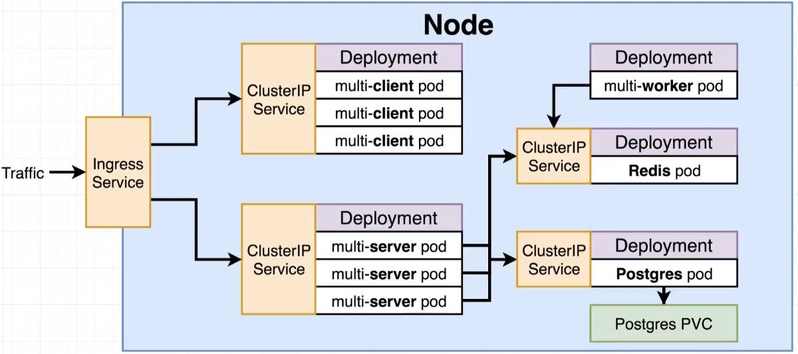

# fibonacci calculator

## Components / Apps

- Client - Web app using Flutter. Meant to be hosted using nginx directly in composer or k8s.
- Server - Spring boot backend REST APIs exposed for front-end usage. Connects to Postgres and Redis stores.
- Worker - Event listener that is using redis for specific events and updates the cache.



## Enable ingress

- https://kubernetes.github.io/ingress-nginx/deploy/#quick-start

## Init commands

```sh
# Secret for Postgres DB
kubectl create secret generic pgpassword --from-literal PGPASSWORD=123

# Build images from inside client, server and worker in order
docker build --progress=plain -f ./Docker/Dockerfile -t fib-client .
docker build --progress=plain -f ./Dockerfile -t fib-server .
docker build --progress=plain -f ./Dockerfile -t fib-worker . 

# Powershell apply all k8s configs from root folder
$paths = ((Get-ChildItem -Recurse -Path ./).Directory | Select-String -Pattern ".*k8s.*") | Select-Object -Unique
$paths | ForEach-Object -Process {kubectl apply -R -f $_}
```

Then access `http://host.docker.internal` or `http://gateway.docker.internal`

## Structure

- k8s folder contains resources that do not belong to specific code/project/microservice/repository.
- k8s folder in each project contains resources related to that project.
- Dockerfile either in the root of the project or inside `Docker` folder in case there are multiple resources/dependencies related to Dockerfile build steps.
- Deployment with `imagePullPolicy: Never` to pull images from local repo instead of online. This prevents pushing images after building them locally.