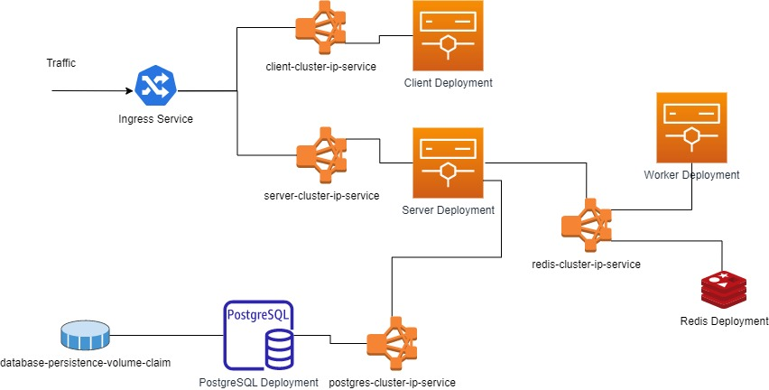

# Votes Append App

## Components / Apps

- Client - Web app using Flutter. Meant to be hosted using nginx directly in composer or k8s.
- Server - Spring boot backend REST APIs exposed for front-end usage. Connects to Postgres and Redis stores.
- Worker - Event listener that is using redis for specific events and updates the cache.



## Enable ingress

- https://kubernetes.github.io/ingress-nginx/deploy/#quick-start

## Init commands

```powershell
# Secret for Postgres DB
kubectl create secret generic pgpassword --from-literal PGPASSWORD=123

# Build images from inside client, server and worker in order
cd client
flutter build web
docker build --progress=plain -f ./k8s/Dockerfile -t vote-client .
cd ..

cd server
docker build --progress=plain -f ./k8s/Dockerfile-build -t vote-server-build .
docker container run -it --rm  -v ${PWD}:/opt/app -v gradle_home:/opt/gradle-home vote-server-build
docker build --progress=plain -f ./k8s/Dockerfile -t vote-server .
cd ..

cd worker
docker build --progress=plain -f ./k8s/Dockerfile-build -t vote-worker-build .
docker container run -it --rm  -v ${PWD}:/opt/app -v gradle_home:/opt/gradle-home vote-worker-build
docker build --progress=plain -f ./k8s/Dockerfile -t vote-worker .
cd ..

# Powershell apply all k8s configs from root folder
$paths = ((Get-ChildItem -Recurse -Path ./).Directory | Select-String -Pattern ".*k8s.*") | Select-Object -Unique
$paths | ForEach-Object -Process {kubectl apply -R -f $_}
```

## Structure

- k8s folder contains resources that do not belong to specific code/project/microservice/repository.
- k8s folder in each project contains resources related to that project.
- Dockerfile is for building the main image of each app
- Dockerfile-build is for building a build image. A container should be run from this image to build the app inside the container (with bind mount) to generate the deployment artifacts. Then building Dockerfile should be done.
- Deployment with `imagePullPolicy: Never` to pull images from local repo instead of online. This prevents pushing images after building them locally.
- Each app deployed with service for network communication and deployment for actual app running. Exceptions are the ingress which is just service for routing and postgresql which has a PVC resource for persistence.

## Apps

- Ingress for main user requests routing and interfacing. This is the entry point.
- client - flutter web app that connects to server app via http & websocket.
- server - spring boot app that exposes http and websocket interfaces for communication. connects to redis and postgresql.
- Redis.
- PostgreSQL.
- worker - spring boot app that runs as worker with no interfaces exposed. connects to redis.

## Business

- User loads the app via browser by requesting localhost. This hits the ingress > client clusterIp service > client deployment.
- Flutter app (client) loads in the browser and fetches votes from server which fetches votes from redis in structured way if exists, otherwise returns zeros as defaults. Also connection to server websocket starts at this point.
- When user press yes/no, a http post request goes to the server to update the postgresql with incremented vote value then a notification to redis is sent and notification sent via websocket. 
- Worker listens to the notification sent via redis and parses the data to save them properly in redis.
- Once the client/flutter app receives the websocket message it re-fetches the votes from the server as in the first step.