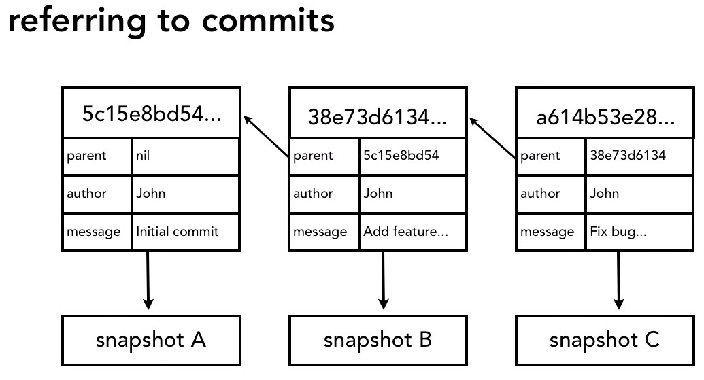

# Intro

- There are repositories in git with no master one. They all are alike tracking changes sets.
- System Configuration

    > Program Files\Git\mingw64\etc\gitconfig  
    > Program Files\Git\etc\gitconfig  
    > /etc/gitconfig  

- User Configuration

    > ~/.gitconfig  
    > $HOME/.gitconfig  OR  %userprofile%\\.gitconfig  

- Project Configuration

    > Project_Folder/.git/config  

---

## Help

`git help`

Show man page for specific command (Use F, B & Q for Navigation)

`git help log` or `man git-log`

---

## Git Architecture

Changes sets use hash to refer to each change set or commit

Two tree architecture like most SCV

Git uses Three tree architecture

HEAD points to parent commit for next commit, in other words, it's where the next commit is gonna happen. Wherever you [checkout a branch](#switch-branch), the HEAD points to that branch where the next commit is gonna take place. Inside the .git folder, HEAD and refs where this is recorded. HEAD file looks to branch, refs folder has the branch with commits details.

---

## Config Commands

 System level

`git config --system` - for example `git config --system credential.helper "manager"` to remember your authentication details for remote repositories

User level

`git config --global`

Project level

`git config`

List all Configurations

`git config --list`

List specific Configurations

`git config user.name`

Tell git what editor to use

`git config --global core.editor "notepad.exe"`

`git config --global core.editor "vim"`

Enable Colors for User Interface in git

`git config --global color.ui true`

### Examples

`git config user.email "my.name@email.com"`

`git config user.name "Anddo Afumedo"`

`git config --global user.name "Anddo Afumedo"`

[`git config --global core.execludesfile path_to_dir/.gitignore_global`](#gitignore-global)

---

## Notes

### Basic flow

- Make changes
- Add changes
- Commit changes

### Commit message best practice

- Short single-line summary (less than 50 characters)
- Optionally followed by a blank line and a more complete description
- Keep each line to less than 72 characters
- write commit messages in present tense, not past tense
  - "fix bug" or "fixes big" not "fixed bug"
- bullet points are usually asterisks or hyphens
- can add ticket tracking numbers, CR numbers from bugs or support requests
- can develop shorthand for your organization
  - `[css,js]` messing with css/js
  - `bugfix:` indicates to bug fix
  - `#38405 -` tracking number
- Be clear and descriptive
  - Bad: `Fix type`
  - Good: `Add missing > in project section of HTML`
  - Bad: `Update login code`
  - Good: `Change user authentication to use Blowfish`
  - Bad: `Updates member report, we should discuss if this right next week`

### Others

- Track empty folders by adding empty file in them. Usually named `.gitkeep` placed inside the empty folder and committed.

### Gitignore

- Read about .gitignore at [this documentation](https://git-scm.com/docs/gitignore). Basically it's wild card matching patterns to not track specified/matched files and folders. These patterns listed in `.gitignore` file and this file should be shared.
- [A collection of  `.gitignore`  templates](https://github.com/github/gitignore)
- [Article about ignoring files](https://help.github.com/articles/ignoring-files/)
-  To ignore files globally on the current working machine only use global ignoring by making specific file for your own specific ignores using the following command  
`git config --global core.execludesfile path_to_dir/.gitignore_global`  
Noting that it could be named anything and it's probably shouldn't be shared with others

---

## Working with git

Initialize the project in current path

`git init`

Add every change in current directory to the staging index.

`git add .` or  `git add file1.txt file2.txt`

Add every deleting files change in current directory to the staging index. Use this before deleting the file manually to delete it using git or delete the file manually then use the command to submit changes of deletion only.

`git rm file1.txt file2.txt`

Stop tracking specific file without deleting it.

`git rm --cached file1.txt file2.txt`

Put the change in a repository

`git commit -m "first commit"`

Add modifications to the staging index then to the repository directly in one step. This will not be applied to removed or non-tracked (newly added) files

`git commit -am "direct commit example"`

Report the difference between working directory, staging index and repository

`git status`

See the changes on modified local file with the one on the stage/repository. The --- is the one on stage/repository and the +++ is the modified local one. Tip: when showing the difference, toggle long lines by typing `-S` then hit `Enter`.

`git diff` or `git diff file1.txt`

To see the changes same way but on the stage index use `--staged` flag.

`git diff --staged`

Specific commits might be used to show difference between them

`git diff 1389856a77` or `git diff 1389856a77 fileName.html`  - changes between that commit and current working files  
`git diff 1389856a..2204ac6` or `git diff 1389856a..HEAD` - between two commits  
[`git diff master..other_branch`](#compare-branches)  
`git diff 1389856a..2204ac6 --summary --stat`  
`git diff 1389856a..2204ac6 --ignore-space-change`  
`git diff 1389856a..2204ac6 --ignore-all-space`  

Move or rename file (You may rename the file manually then use `git rm file1.txt` to remove the old file and `git add file1_renamed.txt` to add the new one then git will catch the renaming action automatically). Better to use `git mv` as the following though

`git mv file1.txt file1_renamed.txt"`

`git mv file1.txt directory/file1_renamed.txt"`

Get the current version in the repository to local working copy and override it. **Note** the `--` to tell git that we are working with the files and directories in current branch only but not the branches.

`git checkout -- fileName.html` or `git checkout -- *`

un-stage a file or in other words, go back for modifying or adding file to stage index but keeping the local copy as it is. Simply resetting the same last commit tip that HEAD currently points to in the repository. Same as `checkout` but for staging index. So it's checking out from staging index to local

`git reset HEAD fileName.html`

Do changes to the last commit like doing additional change to a file and commit it to the same last commit. No additional commit will be added but the sha (commit hash) will be changed and no modifications in this last commit will be lost.

`git commit --amend -m "same message as last commit or differenct one"`

Retrieving old version of the file from any commit to the staging index using the hash/sha of the commit. You may use part of the hash (first 10 characters or something) which make it unique enough to be identifiable.

`git checkout 1389856a7793eacbe9a37bed5ad451904882360d -- fileName.html`

Revert changes directly and flip any commit changes. This will make a new commit for the reverted changes but adding `-n` will prevent making a commit.

`git revert 1389856a7793eacbe9a37bed5ad451904882360d` - use `--no-commit` for no commit message
`git revert 1389856a7793eacb..HEAD` - to revert multiple commit from HEAD to specified hash

Delete un-tracked files

`git clean -n` for testing and `git clean -f` for actual cleaning

Remove untracked files (e.g., new files, generated files)

`git clean -f`

Remove untracked directories (e.g., new or automatically generated directories)

`git clean -fd`

Show details of specific commit

`git show 1389856a7793eacbe`  
`git show --format=oneline 1389856a7793eacbe`  
`git show HEAD`

Stash modified files temporarily usually for swapping between branches. Stashes could be retrieved on any branch and seen while being on any branch

`git stash save "Edits about blah blah. This message for stash only"`

`git stash list` - Show a list of the things in the stash indexed like `stash@{0}`  
`git stash show stash@{0}` - Show more details about this stash. Use `-p` even for more info (show as a patch)  
`git stash apply stash@{0}` - getting the stashed items leaving copy in the stash  
`git stash pop stash@{0}` - getting the stashed items out of the stash  
`git stash drop stash@{0}` - Remove the stash  
`git stash clear` - Clear the stash of all stashes  

---

## Git Log

Show commit messages, messages with limited number, messages since/until specific date, messages with author, regex search

`git log` or `git log HEAD`

`git log -n 5`

`git log --since=2012-06-14` or `git log --since="2012-06-14"`

`git log --until=2012-06-14`

`git log --author="Ahmed"`

`git log --grep="Fi[a-z]st"`

`git log --oneline` or `git log --format=oneline` - One line list . `format` values also could be `short`, `full`, `fuller`, `email`, `raw`
`git log --oneline -3` - Limiting to 3 commits  
`git log 1389856..2204ac6` - Range of commits from hash of `1389856` to `2204ac6`  
`git log fileName.html` - log of changes on that file  
`git log -p fileName.html` - patch log of changes on each commit. The option `-p` added to show the difference  
`git log --stat --summary` - statistics about what changes in each commit  
`git log --graph` or `git log --oneline --graph --all --decorate`  
`git log --oneline branch_name` - while branch_name could be any branch even remote one like `origin/master` and would be the local copy of the remote branch

---

## Git Reset

`git reset` relocate/reset the HEAD to the specified commit. Use with **caution**.  Once HEAD is relocated, the commit chain starts from that point forward. All commits the HEAD skipped while being relocated back to the specified commit are simply ignored and wont be viewed using `git log` so you might want to save their hashes before resetting. There are three types of resetting the HEAD

-\-soft

- doesn't change staging index or working directory

`git reset --soft 1389856a7793eacbe9a37bed5ad451904882360d` or `git reset --soft 1389856`

-\-mixed (default)

- changes staging index to match repository
- doesn't change working directory
- Similar to `git reset HEAD fileName.html` but here is getting the `fileName.html` from the the repository commit pointed to by the HEAD to the staging index so the end result that the file is actually un-staged

`git reset --mixed 1389856a7793`

-\-hard

- changes staging index and working directory to match repository

`git reset --hard 1389856a7793`

---

## Referencing Commits

### tree-ish

To reference to a commit or a tree-ish the following might be used

- Full sha-1 hash
- Short sha-1 hash
  - at least 4 characters (small projects)
  - unambiguous (8-10 characters for mid-level projects)
- HEAD pointer (which of course points to the tip of the currently checked out branch)
- Branch reference, tag reference
- Ancestry. Using any of the previous methods with referring to that object ancestry like `HEAD^`, `1389856a7793^`, `master^` or `HEAD~1` to go up one level. Grandparent also could be referred like `HEAD^^`, `1389856a7793^^`, `master^^` or `HEAD~2`. And so on.

List a tree of files and folders in the repository based on the reference passed. blob is a file & tree is a folder.

`git ls-tree HEAD` - list the tip of current checked out branch at the repository  
`git ls-tree master` - list the branch master repository  
`git ls-tree master folderName/` - look inside a directory  
`git ls-tree master^ folderName/` - inside directory but back one commit  
`git ls-tree 1389856a7793` - same of the above if `1389856a7793` is the sha-1 of `folderName` at last commit of branch `master`

---

## Branches

`git branch` - See what branches are there and what's you're working on right now  
`git branch new_branch_name` or `git branch new_branch_name HEAD` - Create new branch. Use letters, numbers and underscores as best practice. Branch created from the commit currently HEAD looking into on the current working branch  
`git checkout new_branch_name` - Switch to other branch. HEAD will still look to same hash until new commit is done then HEAD moves accordingly. When switching branches, all files and folders are changing to match that branch immediately.  
`git checkout -b new_branch_name` - Create new branch and switch to it at once  
Use `git log --graph --oneline --decorate --all` to see commit quick differences between branches  
`git diff master..other_branch` - Compare two branches and adding `--color-words` will make it in one line comparison  
`git diff master..other_branch^` - Comparison with the commit before the last on `other_branch`  
`git branch --merged` - Find out whether one branch completely contains another branch or not. Branches showed using this command means they are included in the current branch  
`git branch -m old_branch_name new_branch_name` - Rename a branch. `-m` is same as `--move`  
`git branch -d branch_name` or `--delete` - Delete a branch

`git merge other_branch_name` - Merge `other_branch_name` to current working branch that I'm working on. This might do fast-forward (without commit message) merge specially if the branch I'm working on (merge receiver) has no changes at all since `other_branch_name` has been made  
`git merge --ff-only other_branch_name` - Do fast-forward merge if possible or abort.

**Fast forward** merge is when commits done on the other branch but HEAD still as it is (no commits/changes done) on this branch. Git looks from the last commit parent and up on the other branch. If HEAD is there on any corresponding commit on this branch (which should be the case since no changes done on this branch) then fast-forward is done which is simply append different commits from other branch to this branch then moving the HEAD to the last commit

`git merge --no-ff other_branch_name` - Enforce new commit message for the merge so no fast-forward merge  
`git merge --abort` - Exit merge status if you're in the middle of a merge waiting to resolve conflict

### Conflict

If there are changes and multiple commits on the working branch (merge receiver) and the branch we want to merge then there might be a conflict in the merging process.

### *To resolve a conflict there are three options*

- [abort merge](#abort-merge)
- resolve the conflicts manually
  - Use `git status` and edit each file by hand then remove the `<<<<<<< HEAD` of start and ending of comparison and the `=======` in between. Noting that these marks are inside the file since the conflict appeared and once you removed them then you resolved the conflict
  - Once finished all editing, do `git add fileName.html` for the files edited then `git commit` without message
- use a merge tool
  - Use `git mergetool --tool=` to set the tool you want
  - Use `git mergetool` for candidates

### *Conflict Avoiding Tips*

- keep lines short
- keep commits small and focused
- beware stray edits to whitespace
  - spaces, tabs, line returns
- merge often, if you can !
- track changes to master, keep getting the master changes to your branch to be in sync

---

## Rebase

`git rebase master new_feature` - Replay commits strarting from the current head of the master since there are some commits on master I need to merge on top of them, not ignoring them.

Before Rebasing

After Rebasing

`git merge-base master new_feature` - Whill give the sha of base commit that is clean point between branches before start diverging

`git rebase --continue` - in case of conflict, this one says that I've resolved this commit so go ahead and commit it. This of course should be used after modifying conflicting file(s) and resolving the conflicts then adding the change file through `git add fileName.txt` then the `git rebase --continue` should be applied.

`git rebase --skip` - skip this commit and continue with other commits

`git rebase --abort` - do not do rebase at all

`git pull --rebase` - doing pull but rebase your current commits on current local branch to start off the comming commits from remote branch. So it will now make commit of merge because of the pull. Good to use on local non-important commits

---

#### Remote Repositories

- Remote repository is centralized repository (by convention) for sharing different changes that are going on
- Remote repository is a simply git repository with HEAD pointer, commits & branches
- As the following image shows, we make changes on our local repository (my computer: master) then we do `push` to upload changes to the remote repository (remote server: master). git also sync the changes to our another local reference to the remote server branch (my computer: origin/master). *origin/master* points to hash in `.git/refs/remotes/origin/master`. This is one step process

- As the following image shows, users make changes on the remote repository (remote server: master) then we `fetch` these changes to our local branch that references to the remote server branch (my computer: origin/master). **Note** that this is first step of downloading the changes, next step is merging so it's two step process    

- As the following image shows, we `merge` the local branch that references to the remote server branch (my computer: origin/master) to our local branch (my computer: master). **Note** that git is smart that it doesn't actually make two local different branches (origin/master and master) but this is just for elaboration. It creates a pointer other than the local HEAD of master, that pointer is origin/master that should try always to be in sync with remote master   

##### Working with Remotes (gitlab, github ...etc)

- Create remote repository on github. Create local repository using `git init` if you don't have one
- Or use `git clone <url> <folder_name_optional>` to download remote repository files to start contributing. This creates a local tracking branch or simply a reference `origin/master`. **Note** that this command doesn't require existence of local git initialization
- Use `git remote` like `git branch` but for the remotes. Examples
  - `git remote` - list all the remotes
  - `git remote -v` - list all the remotes for pushing and for fetching, usually same but doesn't have to be
  - `git branch -r` - list remote branches
  - `git branch -a` - list all branches
- `git remote add <alias> <url>` - alias is any name you like as an alias for the remote repository and url is the url where the remote could be found. By convention, alias goes for `origin`
- `git remote set-url origin https://github.com/USERNAME/REPOSITORY.git` - Change remote url
- Details about remotes stored in `.git/Config`
- `git remote rm origin` - Remove the remote
- `git push -u origin master` or `git push -u origin master:master` - `origin` is the alias for the remote and `master` is the local branch name that we wanna push. In case of `master:master` it means `local_branch:remote_branch` but since they have same naming it's not necessary to do it that way. The `-u` is to add the remote tracking for this `master` branch in the `.git/config` file.
- `git push` - Use for already tracking branch, like if you already on master and have origin/master on your config to track the remote
- To make any local branch tracking remote branch you have 3 options
  - Use `-u` when pushing to the remote branch
  - Add the config manually - *master* is the remote & local branch name and *origin* is the alias for the remote and `refs/heads/master` is what will be used when doing merge to local branch
  - `git config branch.master.remote origin`
  - `git config branch.master.merge refs/heads/master`
  
    > The config in `.git/config` will be like the following for multiple branches examples
    > [remote "origin"]  
    > url = <https://github/References.git>
    > fetch = +refs/heads/*:refs/remotes/origin/*  
    > [branch "master"]  
    > remote = origin  
    > merge = refs/heads/master
    > [branch "test_branch_local"]  
    > remote = origin  
    > merge = refs/heads/test_branch_remote  
    > [branch "another_branch"]  
    > remote = origin  
    > merge = refs/heads/another_branch
    > [branch "another_local_branch"]  
    > remote = origin  
    > merge = refs/heads/another_branch  

  - Use `git branch --track master_local origin/master_remote` while usually `master_local` & `master_remote` are just `master`
- [`git log --oneline origin/master`](#git-log-branch) - to see commits of my copy of the remote branch `master`
- [`git diff origin/master..master`](#compare-branches) - to see commits of my copy of the remote branch `master`
- `git fetch origin` - sync remote repository to local `origin/master` tracking branch. Might use `git fetch` if only one remote alias is there
- [`git merge origin/master`](#merge-branches)  - merge `origin/master` to the branch I'm currently working on. Usually this is done after a `fetch`. **Note** that origin/master is totally normal branch except it couldn't be checked out (no commits or changes could be done by us to it, it's managed by git)
- `git pull = git fetch + git merge` - 2 steps in one
- [`git branch another_branch_name origin/another_branch_name`](#create-branch) - Create branch starting point from the same as the remote branch or simply similar local branch to remote one. It will track the remote one automatically. The remote branch could be created previously locally then pushed or created using the website manually.
- [`git checkout -b another_branch_name origin/another_branch_name`](#checkout-new-branch) - Create new branch and check it out or check out `another_branch_name` as new branch
- [`git push origin :branch_name`](#remove-remote-branch) or `git push origin --delete branch_name` - Remove the remote branch

##### Notes of good practices about fetching

- fetch before you work
- fetch before you push
- fetch often

##### Additional Notes

- Usual procedure to push changes is to *fetch*, *merge* then *push*. Specially if you can't push directly because someone pushed changes to the remote before you
- To keep track the remote, fetch often
- To make someone else push and fetch to/from your remote, simply add him/her as a collaborator or member. This way he/she could has a read and write access.
- To work on open source project, it can't be everyone can do a commit !!. The contributor will have to
  - Look to the network/contributors to make sure there isn't someone else working on same change
  - Look to the issues list and see if someone posted there about the problem or the feature and maybe even started discussion about it. There is no sense in duplicating someone else's effort
  - Post in the issue list to make sure others see that you got this
  - `Fork` the project to your own gitlab/github repository then make changes and after being completely done, go back to the project page and make a `pull request`. It's like raising your hand and saying "I have something here I wanna show you". You submit a message with your request identifying the problem/feature and how it's good for the project. Finally if all are OK, your branch will be grabbed and merged in

##### Collaboration Workflow Example

Say we are two members. Member_1 is the repository owner and already has read/write access to it. Member_2 is added as a member to the project by Member_1 so he also has write/read access to the repository.

Member_1 has local repository setup and pushed at least the master branch up to the remote repository. One day, Member_1 decided to implement new feature called Feature_1, at that day:

Member_1:

- `git checkout master` - Make sure I'm on my `master` branch
- `git fetch` - To know what changes are there since last time I checked in
- `git merge origin/master` - I found new features or changes added when fetched so I get these features by merging them to master after fetching. Now my master branch is in sync with the remote branch
- `git checkout -b new_branch_feature_1` - Create and switch to brand new branch to implement the new feature on it
- `git commit -m "Add new feature Feature_1"` - This is my change
- `git fetch` - Because I'm about to upload the new feature to the remote so would check if there are new commits or changes on the remote master. In this example at this point, there is none
- `git push -u origin new_branch_feature_1` - Push the branch up to `origin` remote and keep tracking it using the `-u` option

Member_2 also already has local repository setup and been working on it for couple of weeks, if that's not case, he would have to do `git clone <url>` in order to get the repository

Member_2:

- `get checkout master` - Make sure I'm on the master branch
- `get fetch` - Get latest changes. `git branch -r` will show the new branch now
- `git merge origin/master` - Some changes found and get them to my local master branch
- `git checkout -b new_branch_feature_1 origin/new_branch_feature_1` - Create a local branch called `new_branch_feature_1` and track it using `-b` option and its starting point is `origin/new_branch_feature_1`. That way I have the new branch I found remotely on my local machine
- `git log` - See what are the changes on that new branch
- `git show 1389856a` - Take a look on the commit itself
- `git commit -am "Add new feature Feature_2"` - After implementing new feature on the new branch it gets committed with proper message
- `get fetch` - Before pushing `Feature_2` to check if there are any changes, in this example there are none at this point
- `git push` - Branch already tracked and we are on it locally so no need to the branch name on the command or `-u` option

Member_2 sends and email to Member_1 says I made a quick change as `Feature_2` on the new branch. Member_1 now will see the new change

Member_1:

- `git fetch`
- `git log -p new_branch_feature_1..origin/new_branch_feature_1` - To see changes done by Member_2 before merging them into my branch. Starting from my local copy of `new_branch_feature_1` up to where `origin/new_branch_feature_1`
- `git merge origin/new_branch_feature_1` - I liked the changes, I merged them to my local branch
- `git checkout master`
- `git fetch` - Check if there are any changes that came in while I was looking to Member_2 changes
- `git merge origin/master` - If there were changes, I merge them into my master
- `git merge new_branch_feature_1` - I merge the whole new work to my master branch. I could've done merge from `origin/new_branch_feature_1` instead, no difference at this point since they both look to exact same commit. I also at this point might resolve any conflict that may come up
- `git push` - Push my changes on master branch to the remote including all my work

---

#### Command line / Terminal tip

Use `__git_PS1` to show the branch name in the terminal. To make it shows as a source (left side username of the terminal showing current path) use the command `export PS1='\W$(__git_PS1 "(%s)") > '`. To make it permanent edit`.bash_profile` and the exact same command to it.

`git config --global alias.logg "log --graph --decorate --oneline --abbrev-commit --all"` - Creating alias in the config. Now `git logg` would execute same as `git log --graph --decorate --oneline --abbrev-commit --all`. It's like text replacement

---

#### Gitlab / Github

To avoid entering credentials every time you wanna communicate with the remote repository and also for better security, I recommend using SSH. There are many guides explaining what and why and even how but here are the quick steps. Apply the commands in git bash

- Check if there is public SSH key using one of the following commands:
  - `cat ~/.ssh/id_rsa.pub` - If you see a string starting with ssh-rsa you already have an SSH key pair and you can skip the generate portion of the next section and skip to the copy to clipboard step. If you don't see the string or would like to generate a SSH key pair with a custom name continue onto the next step. If you do, you can add your SSH key to the ssh-agent.
  - `ls -al ~/.ssh` - The command lists the files in your .ssh directory, if they exist. Check the directory listing to see if you already have a public SSH key. By default, the filenames of the public keys are one of  id_dsa.pub, id_ecdsa.pub, id_ed25519.pub or id_rsa.pub. If you see an existing public and private key pair listed (for example  `_id_rsa.pub_`  and  `_id_rsa_`) that you would like to use then you can add your SSH key to the ssh-agent. If you don't then continue onto the next step.
- Generating a new SSH key pair
  - `ssh-keygen -t rsa -b 4096 -C "<your_email@example.com>"` - This creates a new ssh key, using the provided email as a label. When you're prompted to "Enter a file in which to save the key," press Enter. This accepts the default file location.
  - At the prompt, you might type a secure passphrase. it is not required and you can skip creating a password by
pressing enter.
`Enter passphrase (empty for no passphrase): [Type a passphrase]`
`Enter same passphrase again: [Type passphrase again]`
**Note**: If you want to change the password of your SSH key pair, you can use `ssh-keygen -p <keyname>` or `ssh-keygen -p`
- Copy the public key to your clipboard using the following command
  - `clip < ~/.ssh/id_rsa.pub` - Git Bash for Windows, Linux or Mac
  - `pbcopy < ~/.ssh/id_rsa.pub` - Mac
  - `xclip -sel clip < ~/.ssh/id_rsa.pub` - GNU/Linux (requires the xclip package)
  - `type %userprofile%\.ssh\id_rsa.pub | clip` - Windows Command Line
  - `cat ~/.ssh/id_rsa.pub | clip` - Git Bash on Windows / Windows PowerShell
- Add the key to your profile settings in gitub or gitlab
- [`git remote set-url origin git@gitlab.com:username/repository.git`](#change-remote-url) - Change your remote URL to the ssh one.
- Optional:
  - Make sure ssh agent is running - `eval $(ssh-agent -s)`
  - Add current keys to ssh agent - `ssh-add ~/.ssh/id_rsa`
  - For hosting git on local server, refer to the following urls
    - <https://git-scm.com/book/en/v2/Git-on-the-Server-The-Protocols>
    - <https://stackoverflow.com/a/11008133>
    - <https://stackoverflow.com/q/10888300>
    - <https://stackoverflow.com/q/5507489>
